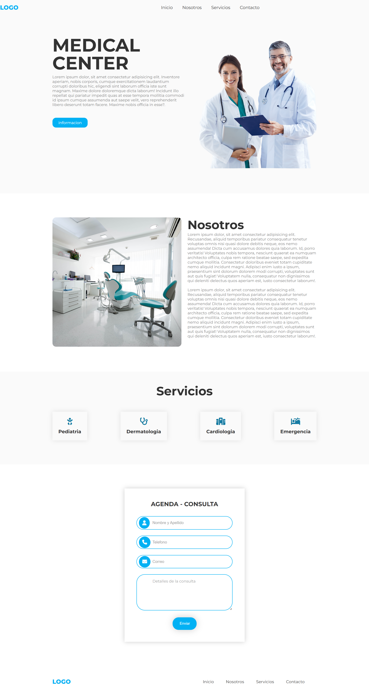

# Página Web para Centro Médico

Este proyecto es una página web básica para un centro médico. Permite a los usuarios enviar consultas mediante un formulario. Las consultas son almacenadas en una base de datos MySQL.

## 🛠 Tecnologías utilizadas

- HTML5
- CSS3
- PHP
- MySQL

## 📌 Funcionalidades

- Formulario de contacto para pacientes
- Almacenamiento de consultas en la base de datos
- Diseño responsive básico (adaptable a pantallas)
- Validación básica de campos 

## 💾 Requisitos para ejecutar localmente

- XAMPP, MAMP o similar
- Navegador web
- Editor de código (Visual Studio Code, Sublime, etc.)

## Vista previa

## 📦 Base de datos

El archivo `database/medical_center.sql` contiene la estructura de la base de datos (y datos de prueba).  
Puedes importarlo en phpMyAdmin para ejecutar el proyecto correctamente.
